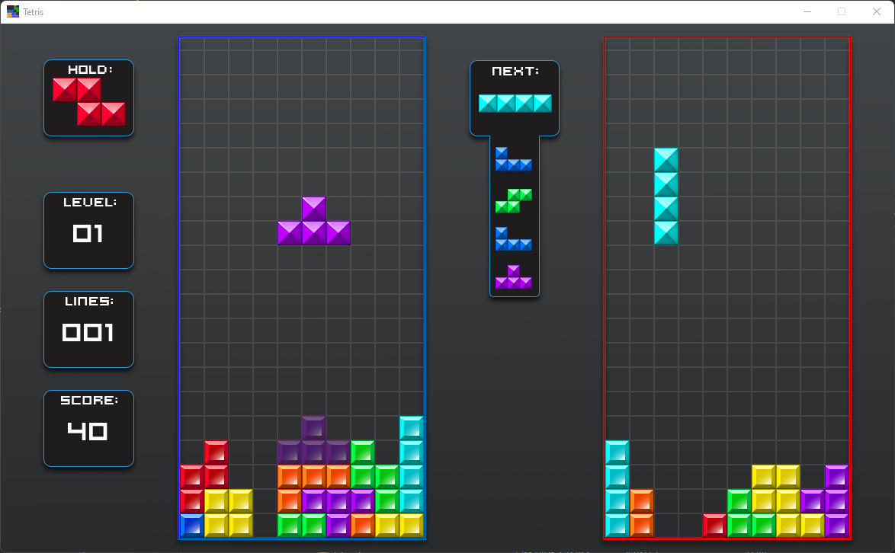
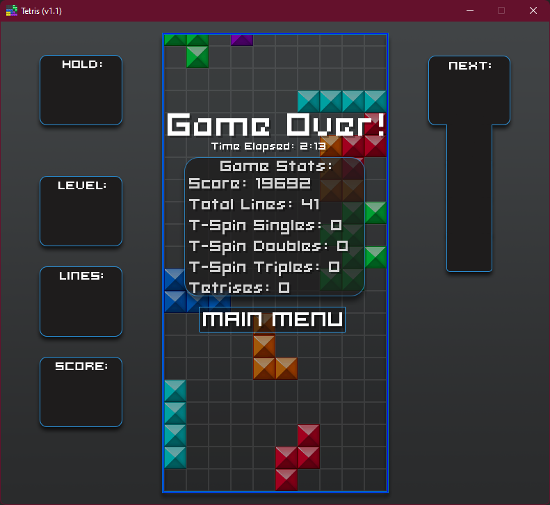

# Tetris (MonoGame)
A full fledged tetris game using MonoGame in C#. 

Includes many features of current-day tetris games such as Super Rotation System(SRS), Online Multiplayer, and much more!

Note: Multiplayer uses port 25565 for online connectivity.

[Download](https://github.com/StrugglingDoge/Tetris-MonoGame/releases/)

