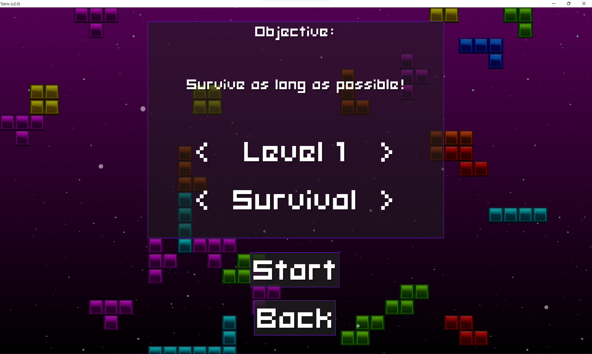
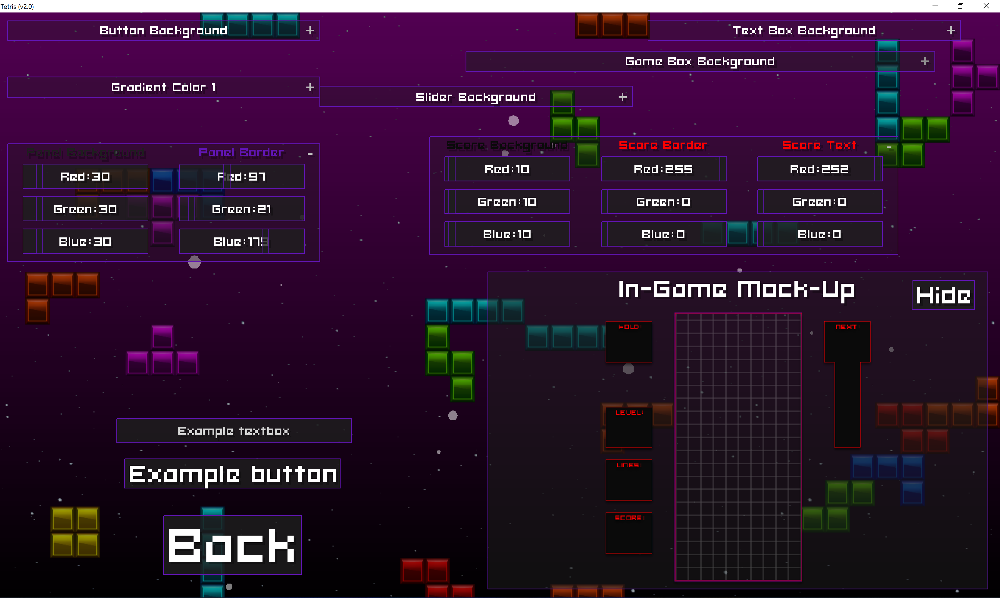
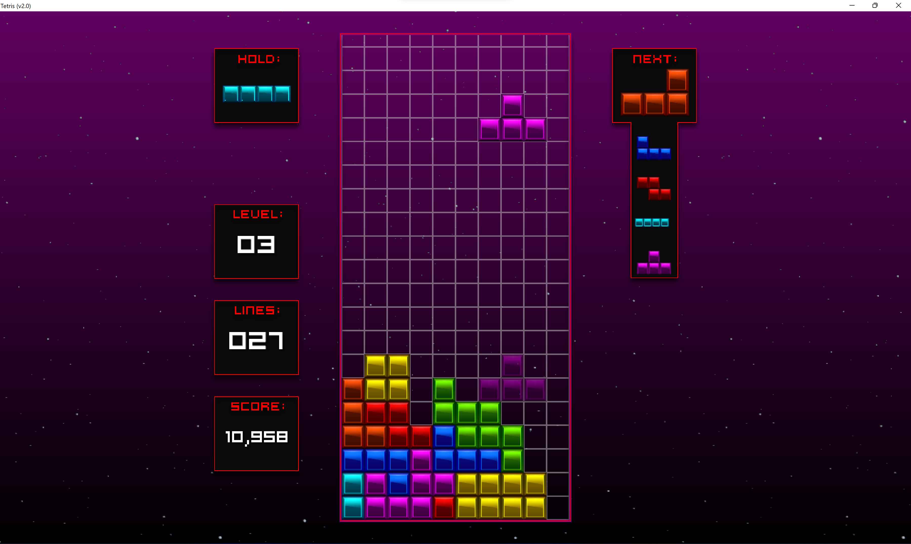
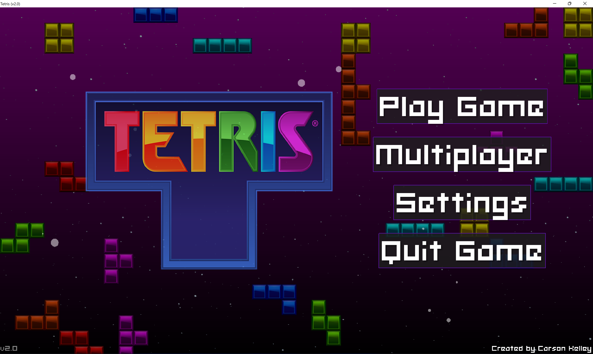

# Tetris (MonoGame)

## A multi-platform tetris game with many familiar features from modern day tetris games like game modes, super rotation system (SRS), multiplayer, and much more!

- ### Download & Information below!

# Download
### To download Tetris go to the release page [here](https://github.com/StrugglingDoge/Tetris-MonoGame/releases/) and download the latest version for your operating system.

- Please see the supported platforms section below to make sure your OS is compatible with Tetris.

_**Mac OS users may need to run the `allowapp.sh` bash script in order to run the application.**_

# Supported Platforms
    - Windows x64
    - MacOS x64
    - Windows Arm64 (Use Win x64 build)
    - MacOS Arm64 (M1, native ARM build)
    
**Currently when running Tetris on a Windows 11 Arm machine there may be an audio delay which is most likely due to the x64 emulation and is out of my control.**
    
# Game Modes
## Survival
- ### Survival is the classic Tetris mode you've come to love. In this mode, your main objective is to stay alive as long as possible while continuing to reach higher and higher levels.

## Time Trial
- ### In Time Trial, your main objective is to get the highest score/highest amount of cleared lines within a 3 minute time limit. Once time has run out the game will end, so act quick!
    
## 40 Line
- ### In this mode, your main objective is to complete 40 lines in the shortest amount of time, or even with the highest score.
    
## Hardcore
- ### Hardcore is for veteran players looking for more of a challenge. In this mode, you are unable to hold tetriminoes, meaning no saftey net! The main objective is to aim for Tetrises and T-spin's as getting double and triple lines will punish you with garbage rows.
    
## Classic
- ### Classic mode attempts to recreate the feel of NES Tetris by changing the following gameplay features: Disabling the ability to hold tetriminoes & use hard drop, and along with those changes, it also implements a custom gravity interval to recreate the feeling of gravity in NES Tetris.
    
**All modes include a explanation on the game preferences page**

# Customizability
Tetris offers a slew of customization tools, allowing you to personalize the UI to your liking.

You are able to change the color of every UI element, including the in-game UI. 

You want the grid in the playing field to be blue? Change it. 
You want the score text to red and the box to be purple? Change it.
You want to make all button borders red and sliders orange? Change it.

You get the idea, you can customize it to your hearts content.

To customize your User Interface, go to settings and open the Color Manager menu right above the "Back" button.

# Multiplayer
Oh yea, Tetris also offers 1v1 multiplayer! 

Go to the multiplayer menu and either join or host a server for you and a friend to battle it out on the Tetris field.

Multiplayer supports all game modes shown earlier, letting you and your friend decide how you prefer to play.

_Multiplayer is P2P and uses LiteNetLib for networking._

# Reporting bugs
If you try out Tetris and find a bug, please open an issue on this repo and describe the bug.

Also, if you can include any pictures/videos of the bug happening along with potentially a way to recreate the bug.

Any reports are much appreciated as it improves the quality of the game and makes me happy :)

# Other Pictures

